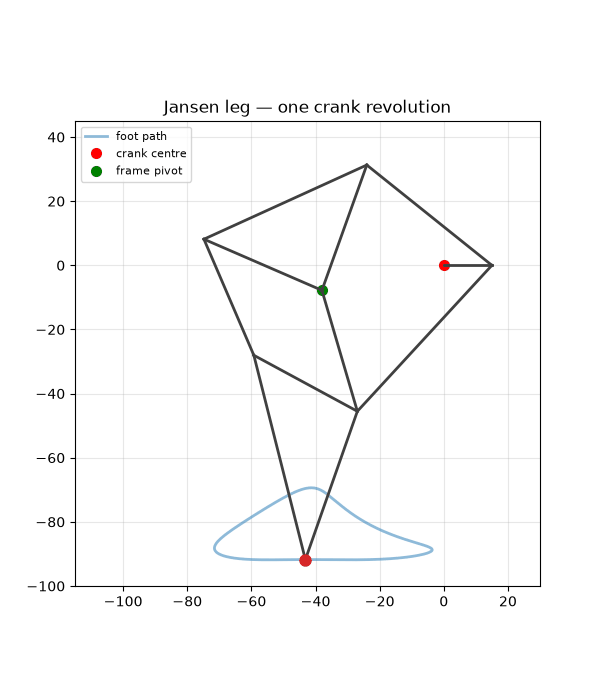
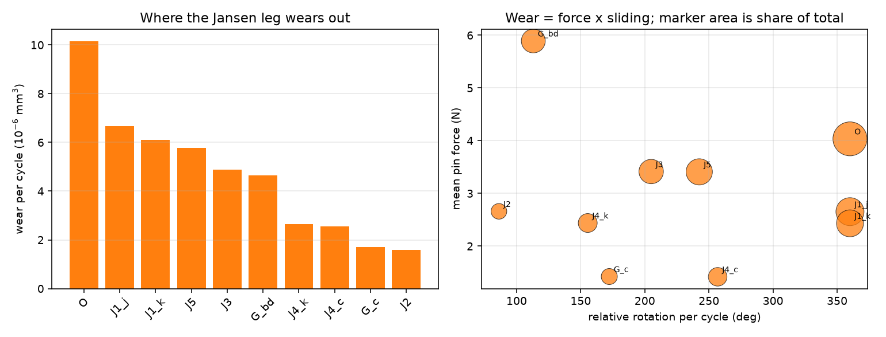
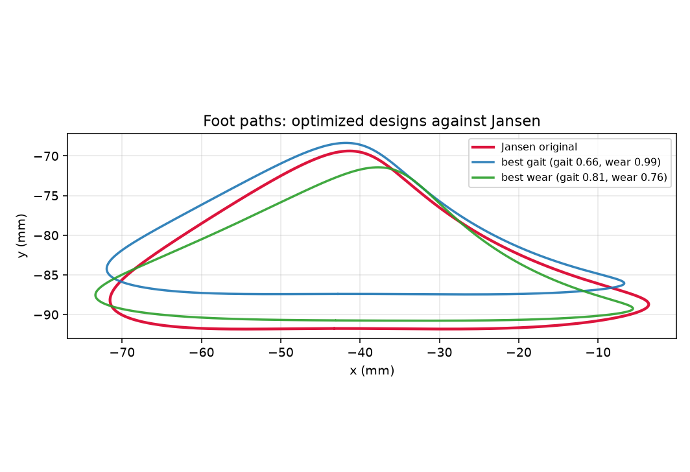
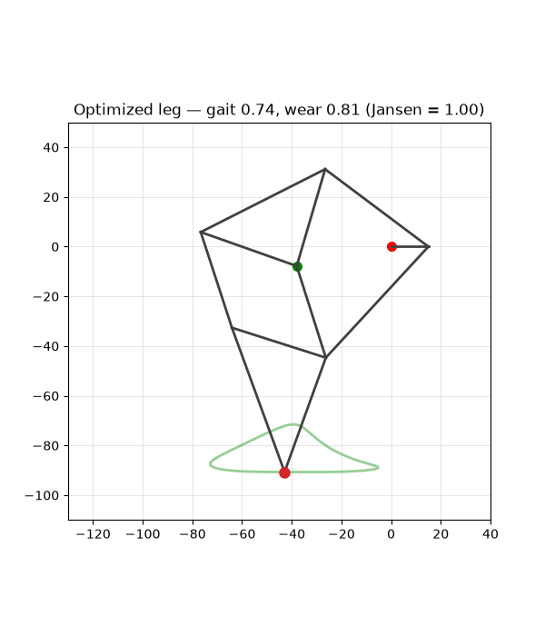

# legsynth

Open-source reproduction and extension of Wang (2026), *"Durability-Aware Multi-Objective
Optimization of the Jansen Linkage"* ([arXiv:2606.22129](https://arxiv.org/abs/2606.22129)) —
a paper that re-optimizes Theo Jansen's walking linkage for joint wear, and released no code.



**What this reproduces:** the full pipeline — kinematics, inverse dynamics, Archard wear,
NSGA-II — and the paper's headline claim that Jansen's linkage is Pareto-dominated.

**What this adds:** explicit published definitions for the gait metrics the paper never writes
down, the manufacturability check it never makes, three measured disagreements with its
reported numbers, and a DXF export so a design leaves the repo as something you can machine.

**What it found:** the paper's Table 4 baseline cannot come from any single definition of
stance; its mean-force wear shortcut costs 51% rather than the 3–4% it claims; its 56% wear
reduction does not reproduce (we find 24%); and its central claim — that Jansen's linkage is
Pareto-dominated — does.

## Reproduce everything in two commands

```
pip install -e .
python scripts/reproduce.py             # every number and figure below (~10 min)
```

`reproduce.py` runs the four stages in the order they depend on each other — gait metrics,
mechanics, both Pareto fronts, then the figures — and each is still runnable on its own:

```
pytest                                  # 90 tests
python scripts/gait_report.py           # Jansen baseline + stance-band sensitivity
python scripts/mechanics_report.py      # pin forces, wear breakdown, transmission angles
python scripts/run_optimization.py      # both Pareto fronts (~10 min, all cores)
python scripts/make_figures.py          # every figure below
python scripts/robustness.py            # the four robustness studies (~50 min)
```

Every number quoted below comes from one of these scripts; none is quoted from the paper
except where it is explicitly labelled as the paper's.

---

## The Jansen baseline, against the paper

Stance is defined as the longest unbroken arc of the crank turn spent within 1% of the foot
path's height above its lowest point — a *fraction* of path height, not a fixed tolerance in
millimetres, so every metric is scale-invariant. Full definitions in
[`docs/METRIC_DEFINITIONS.md`](docs/METRIC_DEFINITIONS.md). Every table in this repo is
measured at **1440 crank samples**; stance is an arc, so its measured extent depends on how
finely the turn is sampled, and one count is quoted everywhere.

| Metric | Ours | Paper (Table 4) | Difference |
|---|---|---|---|
| Step length | 43.41 mm | 43.3 mm | +0.3% |
| Ground clearance | 22.23 mm | 25.7 mm | −13.5% |
| Stance flatness | 0.0011 | 0.0281 | −96% |
| Velocity ripple | 0.0920 | 0.0956 | −3.8% |
| Duty factor | 31.2% | ≈20% | +56% |

Mechanics, which the paper reports only in aggregate: peak pin force **25.8 N** against a 20 N
ground reaction, force amplification **1.29**, peak crank torque **0.026 N·m**, wear
**4.67 × 10⁻⁵ mm³** per revolution.

---

## Three places this disagrees with the paper

Reported, not tuned away. Each is pinned by a test so it cannot quietly drift.

### 1. The paper's Table 4 baseline cannot come from any single definition of stance

The paper never publishes its formulas, so we asked the inverse question: what stance
threshold would our code need to reproduce each of its numbers?

| Paper's number | Band required |
|---|---|
| Duty factor ≈20% | 0.35% of path height |
| Step length 43.3 mm | 0.98% |
| Velocity ripple 0.0956 | 1.27% |
| Stance flatness 0.0281 | 31.2% |
| Ground clearance 25.7 mm | unreachable at any band |

A factor of 90 apart. Step length and ripple agree tightly at ≈1% and are a genuine
reproduction; the rest are not, and the 25.7 mm clearance is taller than our entire 22.46 mm
foot path, so it cannot be a threshold question at all.

### 2. The paper's mean-force wear shortcut costs 51%, not the 3–4% it claims

The paper averages the pin force over the cycle before applying Archard's law. Integrating
force against sliding instead:

| | Wear per cycle |
|---|---|
| Mean-force form (the paper's) | 4.67 × 10⁻⁵ mm³ |
| Integrated form | 3.09 × 10⁻⁵ mm³ |
| **Overestimate** | **+51.3%** |

Force and sliding rate are anti-correlated — the pins are loaded hardest while turning
slowest. The evidence that both calculations are right, and the shortcut is what is wrong: at
the crank pin they agree to **0.0%**, which is the one joint where they must agree
analytically, because the crank turns at a constant rate.

This does not overturn the paper's conclusions, which are stated as ratios. It does mean its
absolute wear figures are high by about half.



The breakdown is worth a look on its own: the three pins that turn a **full** revolution take
49% of the wear between them, not because they carry the most load but because they slide the
furthest. Wear is force times distance, and on this linkage distance does most of the sorting.

### 3. We cannot reproduce the paper's 56% wear reduction

Its two gait claims land close (17% and 51% against its 28% and 58%). Its wear claim does not:
the lowest wear ratio anywhere on our front is **0.758** — 24% less, not 56% — and the design
that gets there gives up gait to do it. See the optimization section below.

---

## The extension: transmission angle, and the word "loaded"

*When one bar pushes the next, the transmission angle decides how much of that push becomes
motion instead of a squeeze on the pin. 90° is perfect; near 0° the joint binds and hammers
itself. Practice keeps it above about 40°. A paper about **wear** that never checks this has
a real gap — a shallow angle is itself a wear mechanism.*

But the obvious constraint gives an obviously wrong answer:

| Measure | Jansen's linkage |
|---|---|
| Min transmission angle, whole cycle | **8.6°** — fails the 40° rule badly |
| Min transmission angle, during stance | **42.7°** — passes |


Both are correct; they answer different questions. Jansen's 8.6° minimum happens mid-swing,
foot in the air, with **0.6 N** in the pin. The cycle's largest pin force, 25.8 N, arrives at
a healthy 48°.

So the constraint this repo enforces is the **minimum transmission angle during stance**.
The naive whole-cycle version would have rejected Theo Jansen's own linkage for a defect that
costs nothing, and any Pareto front drawn under it would have been an artefact.

Read the other way, it is a compliment to the original: Jansen spends his shallow angles
exactly where they are free, and stays above the rule of thumb everywhere they are paid for.

---

## Optimization

Two NSGA-II campaigns (population 100, 80 generations, three runs merged): the paper's
problem, then the same problem with our loaded-transmission-angle constraint added. Both
objectives are ratios to Jansen, so Jansen sits at exactly (1.00, 1.00), lower is better.


**The paper's central claim reproduces: Jansen's linkage is Pareto-dominated.** All 20 designs
on the front beat it on gait error *and* wear at once. The magnitude does not reproduce:

| Claim | Paper | Ours |
|---|---|---|
| Stance flatness | 28% better | 17% better |
| Velocity ripple | 58% better | 51% better |
| Wear | 56% less | **24% less** |
| Link-length changes | ≤29% | ≤8.5% |

**And our own added constraint turned out to be nearly free — reported as the negative result
it is.** Across the 20 designs on the paper's unconstrained front, the minimum loaded
transmission angle runs 41.9°–52.0°, median 48.3°. Not one violates the 40° rule, and the two
fronts lie almost on top of each other.

That the remaining gap is *search noise rather than a cost* is the load-bearing sentence of
the negative result, so it is measured rather than asserted: running the unconstrained
campaign again with different random seeds moves the front further than adding the constraint
does. The numbers are in [`docs/RESULTS.md`](docs/RESULTS.md) §7, from
`scripts/robustness.py`.

Sweeping the threshold turns the null into a design guideline rather than leaving it a
shrug — the constraint is free up to a point and then is not, and §7 says where. The
paper's omission did not damage its conclusions here, but that is a finding about this
problem, not a general licence to skip the check, and it cost one extra geometric evaluation
per design to establish. The part of the extension that *changes* an answer is the
loaded/unloaded distinction above.

One more finding, which changed how the search had to be run: of 600 designs drawn uniformly
from the paper's own ±30% box, 17% assemble and **none** satisfy the paper's constraints.
Stance is a band near the lowest point of the path, so a design that loses Jansen's unusually
flat bottom also loses most of the arc that counts as stance, and its measured step length
collapses with it. The feasible set is a thin shell around Jansen — which is also why no
design on our front moves a link by more than 8.5% where the paper's move by 29% — and the
search is seeded there.



Full numbers in [`docs/RESULTS.md`](docs/RESULTS.md) §6. The balanced design is exported to
`results/cad/optimized_assembly.dxf` and to individual cuttable link profiles, ready for
SolidWorks.



---

## What's in here

| Module | What it does |
|---|---|
| `kinematics.py` | Circle–circle dyad cascade, branch selection solved, NaN on infeasible |
| `metrics.py` | The five gait metrics, with published formulas and a sensitivity study |
| `dynamics.py` | Quasi-static statics: 10 pin forces + crank torque, checked by virtual work |
| `wear.py` | Archard per joint, mean-force and integrated forms |
| `constraints.py` | Loaded transmission angle, force amplification, branch consistency |
| `optimize.py` | NSGA-II over the ten link lengths, two objectives, four or five constraints |
| `cad.py` | DXF R12 assembly, cuttable link profiles, coordinate CSV |

Scripts: `reproduce.py` runs everything; `gait_report.py`, `mechanics_report.py`,
`run_optimization.py` and `make_figures.py` are the four stages; `robustness.py` is the
seed / objective / threshold / stance-band study behind §7 of the results.

The eleven bars are modelled as **7 rigid bodies and exactly 10 revolute joints** — `b,d,e`
close one triangle and `g,h,i` close another, and a triangle of rigid bars is one rigid body.
That derives the paper's joint count rather than assuming it, and Grübler agrees:
3(8−1) − 2(10) = 1 DOF.

## Citation

> J. Wang, *Durability-Aware Multi-Objective Optimization of the Jansen Linkage: Trading Gait
> Quality Against Joint Wear.* arXiv:2606.22129, 2026.

## License

MIT
