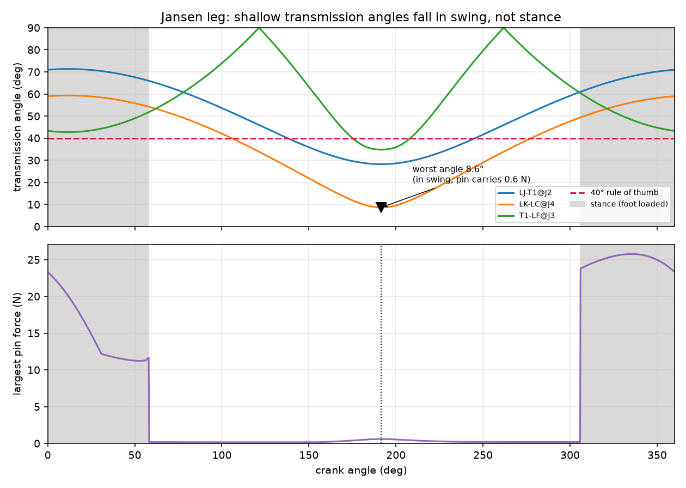
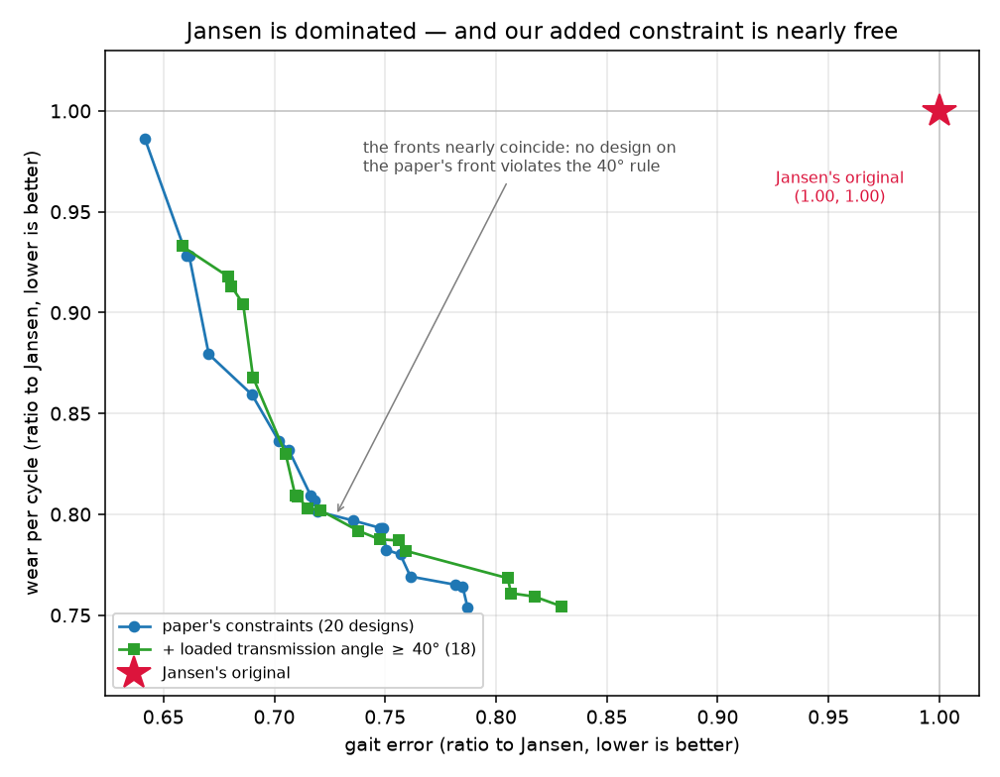

# Results

Everything on this page came out of code in this repo. Regenerate with:

```
python scripts/reproduce.py          # all four stages below, in order
```

or one stage at a time:

```
python scripts/gait_report.py        # gait metrics + stance-band sensitivity
python scripts/mechanics_report.py   # pin forces, wear, transmission angles
python scripts/run_optimization.py   # both Pareto fronts (~10 min, all cores)
python scripts/make_figures.py       # every figure below
python scripts/robustness.py         # the studies behind §7 (~50 min)
```

Where a number disagrees with Wang (2026), it is reported as a disagreement.
Nothing here has been tuned to match the paper.

---

## 1. The Jansen baseline

Holy numbers, branch `(-1,-1,1,-1,1)`, 1440 crank samples, stance band 1% of path
height. Foot path 67.91 mm wide × 22.46 mm tall.

| Metric | Ours | Paper (Table 4) | Difference |
|---|---|---|---|
| Step length | 43.41 mm | 43.3 mm | +0.3% |
| Ground clearance | 22.23 mm | 25.7 mm | −13.5% |
| Stance flatness | 0.0011 | 0.0281 | −96% |
| Velocity ripple | 0.0920 | 0.0956 | −3.8% |
| Duty factor | 31.2% | ≈20% | +56% |

Step length and velocity ripple reproduce. The other three do not, and
[`METRIC_DEFINITIONS.md`](METRIC_DEFINITIONS.md) shows why: the paper's five
numbers require five mutually incompatible definitions of "stance", spanning a
factor of 90, so no single definition reproduces its baseline row. The ground
clearance is not a definition problem at all — 25.7 mm is taller than our entire
foot path.

**Mechanical summary (new in this repo):**

| Quantity | Value |
|---|---|
| Peak pin force | 25.77 N at `G_bd`, against a 20 N ground reaction |
| Force amplification | 1.29 |
| Peak crank torque | 0.026 N·m |
| Wear per cycle | 4.67 × 10⁻⁵ mm³ |
| Min transmission angle, loaded | 42.7° |
| Min transmission angle, whole cycle | 8.6° |
| Branch margin | 0.27 |

---

## 2. The statics are verified, not just asserted

The inverse dynamics writes force and moment balance for all 7 moving bodies
(21 equations) and solves for the 10 pin reactions plus the crank torque
(21 unknowns). Nothing in that system knows about energy. So the check is
**virtual work**: at quasi-static equilibrium the motor's power must exactly
equal the power going into gravity and the ground reaction.

    residual = 4.1 × 10⁻⁵  (RMS mismatch / RMS torque, at 1440 samples)

and it falls with the square of the sample spacing, which is the signature of
finite-difference error rather than a modelling mistake. A sign error or a
misplaced moment arm anywhere in the 21×21 system would show up here and does
not.

The body decomposition is worth stating because the paper asserts "ten joints"
without deriving it. Three of the eleven bars close the triangle `G–J2–J3` and
three more close `J4–J5–F`; a triangle of rigid bars is one rigid body. That
leaves 7 moving bodies and exactly **10 revolute joints**, and Grübler agrees:
3(8−1) − 2(10) = 1 degree of freedom.

---

## 3. Where a Jansen leg actually wears out

Archard: worn volume = k × force × sliding distance, per joint, per crank
revolution.

| Joint | Mean force | Relative rotation | Sliding | Share of total wear |
|---|---|---|---|---|
| `O` (crank pin) | 4.03 N | 360° | 25.1 mm | 21.7% |
| `J1_j` | 2.65 N | 360° | 25.1 mm | 14.3% |
| `J1_k` | 2.43 N | 360° | 25.1 mm | 13.1% |
| `J5` | 3.41 N | 242° | 16.9 mm | 12.3% |

The three pins that turn a full revolution take 49% of the wear between them,
not because they are the most heavily loaded but because they slide the
furthest. Wear is force **times** distance, and on this linkage the distance
term is doing most of the sorting.

### The paper's mean-force shortcut costs 51%, not 3–4%

The paper computes wear from the cycle-*average* force rather than integrating
force against sliding, and argues the simplification costs 3–4%. We can measure
that instead of arguing it:

| | Wear per cycle |
|---|---|
| Mean-force form (the paper's) | 4.67 × 10⁻⁵ mm³ |
| Integrated form | 3.09 × 10⁻⁵ mm³ |
| **Overestimate** | **+51.3%** |

Converged across sampling (n = 360 → 5760 moves it by 0.1%). The cause is
physical: pin force and sliding rate are **anti-correlated** — the pins are
loaded hardest during stance, when they happen to be rotating slowest — so
averaging the force first and multiplying by total sliding counts the heavy load
against sliding that happens while unloaded.

The check that this is a real effect and not a bug in one of the two
calculations: at joint `O` they agree to 0.0%. That is the one joint where they
*must* agree analytically, because the crank turns at constant rate, so sliding
is uniform in crank angle and averaging first is exact there. Both calculations
are right; the shortcut is what is wrong.

This does not overturn the paper's conclusions, because they are stated as
ratios and the bias partly cancels between designs. It does mean the absolute
wear numbers are high by about half.

---

## 4. The extension: transmission angle, and why "loaded" is the word that matters

*Transmission angle: when one bar pushes the next, the angle that decides how
much of the push becomes motion rather than a squeeze on the pin. 90° is
perfect, near 0° the joint binds and hammers itself. Machine-design practice
keeps it above about 40°.*

The paper never mentions it, which is a real gap in a paper about wear: a
shallow angle is itself a wear mechanism. But adding the obvious constraint
produces an obviously wrong answer.

| Measure | Jansen's linkage |
|---|---|
| Minimum transmission angle, whole cycle | **8.6°** — fails the 40° rule badly |
| Minimum transmission angle, during stance | **42.7°** — passes |



Both numbers are correct; they answer different questions. The 8.6° minimum
happens at crank angle 192°, in mid-swing, with the foot in the air and **0.6 N**
in the pin. The largest pin force of the cycle, 25.8 N, arrives at crank 335°
where the worst interface is at a healthy 48°. A shallow angle only costs you
something when there is force behind it.

So the constraint this repo enforces is the **minimum transmission angle during
stance**. That matters for honesty as much as for physics: the naive whole-cycle
constraint would have rejected Theo Jansen's own linkage for a defect that costs
nothing, and any Pareto front drawn under it would have been an artefact of a
badly posed constraint.

Read the other way, this is a compliment to the original design. Jansen's
linkage is not sloppy about transmission angles — it spends its shallow angles
exactly where they are free, and keeps them above the rule of thumb everywhere
they are paid for.

**Force amplification** is kept alongside as the measure that needs no
exclusions: the largest pin force in the cycle divided by the load carried.
Jansen sits at **1.29** — the pins carry about what the ground pushes. A design
near a singular pose runs to tens or hundreds, and that is what the constraint
layer is really there to catch.

---

## 5. The feasible region is a thin shell around Jansen

Not a headline result, but it changes how the optimization has to be run, so it
is reported rather than buried in a commit message.

Of 600 designs drawn uniformly from the paper's own ±30% box:

- 103 (17%) assemble through a full revolution at all
- **0** satisfy the paper's constraints (step length, clearance and duty factor
  each ≥ 0.85 × Jansen)

Step length and duty factor fail in essentially every one. Even jittering
Jansen's own lengths by 2% leaves only 4% of designs feasible.

The reason is a genuine coupling between the metric definition and the
constraint. Stance is a band near the lowest point of the foot path, so a design
that loses Jansen's unusually flat bottom stroke also loses most of the arc that
counts as stance — and its measured step length collapses with it. Under an
explicit definition, the paper's step-length constraint is therefore much
stricter than it looks: it is partly a flatness constraint in disguise.

Consequence: the search is seeded from the baseline (`optimize.seeded_population`)
rather than started uniformly. This biases *where the search begins*, not what
counts as good — the objectives and constraints are unchanged. The paper does not
say how it initialised.

---

## 6. Optimization

NSGA-II, population 100, 80 generations, three runs merged per campaign, fronts
re-scored at 1440 crank samples. Two campaigns: the paper's problem, then the
same problem with our loaded-transmission-angle constraint added. 20 minutes
total on one laptop core.



### The paper's headline claim reproduces — its magnitude does not

**Jansen's linkage is Pareto-dominated. Confirmed.** All 20 designs on the front
beat it on gait error *and* wear simultaneously. That is the paper's central
result and it survives an independent implementation.

The size of the win does not.

| Claim | Paper | Ours |
|---|---|---|
| Stance flatness | 28% better | 17% better |
| Velocity ripple | 58% better | 51% better |
| Wear | 56% less | **24% less** |
| Link-length changes | ≤29% | ≤8.5% |

The gait numbers are measured on the best-gait design, which is the comparison
the paper's own "representative redesign" invites.

The two gait numbers land close. The wear claim does not: the lowest wear ratio
anywhere on our front is 0.758, and the design that achieves it gives up gait to
get there. Nothing we found comes near a 56% reduction, and the designs that do
best on wear are not the ones that do best on gait — which is the whole point of
drawing a front rather than quoting one design.

Our optima also sit far closer to Jansen than the paper's do: no design anywhere
on our front moves a link by more than 8.5%, against their 29%. That is
consistent with §5 — the feasible set is a thin shell around Jansen, so a search
that respects the constraints cannot wander far. A search that reported 29%
changes was either exploring a region our constraints exclude, or measuring step
length in a way that tolerates a much less flat foot path.

Representative designs from the paper's (unconstrained) front, all re-scored at
1440 samples — the same count as every other table in this repo:

| Design | Gait error | Wear ratio | Step | Clearance | Duty | Min loaded angle |
|---|---|---|---|---|---|---|
| Jansen | 1.000 | 1.000 | 43.41 mm | 22.23 mm | 31.2% | 42.7° |
| Best gait | 0.658 | 0.992 | 44.43 mm | 18.91 mm | 33.3% | 41.9° |
| Balanced | 0.742 | 0.806 | 38.98 mm | 19.00 mm | 27.6% | 52.0° |
| Best wear | 0.811 | 0.758 | 37.68 mm | 19.15 mm | 26.7% | 46.7° |

"Balanced" is the design with the smallest sum of the two objectives. It is a
defensible pick and not the only one, which is why the whole front is saved to
`results/pareto.json` rather than just this row.

Read the table as the trade-off it is. The best-gait design buys its flat stance
by giving up essentially nothing on wear (0.992) — and it is the only one of the
three that keeps a *longer* step than Jansen. The other two buy their wear
reduction by shortening the stride to about 38 mm, right against the 0.85× floor
the paper's own constraints impose. Every design on the front loses ground
clearance, from 22.2 mm to roughly 19 mm: nothing in either objective rewards
lifting the foot higher, and only the 0.85× constraint stops it falling further.
That is a fair criticism of the paper's objective set, and it is ours too, since
we reproduced it deliberately.

### Our own constraint turns out to be nearly free — and that is a real result

The honest answer to "what does the manufacturability constraint cost?" is:
**almost nothing, because it was not binding in the first place.**

Across the 20 designs on the paper's unconstrained front, the minimum loaded
transmission angle runs from 41.9° to 52.0°, median 48.3°. **Not one of them
violates the 40° rule.** The two fronts in the figure lie essentially on top of
each other. The small differences between them (best gait error 0.658 against
0.676, best wear ratio 0.758 against 0.759) are run-to-run variation in a
stochastic search, not a price paid for the constraint — attributing them to the
constraint would be reading noise as signal.

That last sentence is the load-bearing one, so it is measured rather than
asserted. §7 runs the unconstrained campaign three times with different random
seeds and compares how far the front moves on its own against how far the
constraint moves it.

This is a negative result for the extension, and it is reported as one. But it is
not a wasted one, for two reasons.

First, **you could not have known it without checking.** "The optimizer's
preferred designs happen to be well-conditioned" is a finding about this problem,
not a general fact about linkage optimization. The constraint costs one extra
geometric evaluation per design, and the campaign that includes it is the evidence
that the paper's omission did not damage its conclusions here. A paper that
optimizes for wear while ignoring the geometry that drives wear got away with it
this time; that is worth knowing, and it is worth knowing *why*.

Second, the constraint is doing quiet work at the edges. The two designs on the
constrained front nearest the boundary sit at 42.0° and 42.4°, so the feasible
region is genuinely bounded by it — the search is just not choosing to go there,
because shallow-angle designs are not attractive on either objective anyway. Wear
and transmission angle turn out to be partly aligned objectives on this
mechanism: a shallow angle puts large forces through the pins, and large pin
forces are what the wear objective is already punishing. That is a satisfying
reason for the null result rather than a coincidence, and §7 tests it by
tightening the constraint until it does bite.

**What actually made the extension worth doing** is not the constraint but the
loaded/unloaded distinction in §4. That one changes an answer: naive whole-cycle
enforcement would have rejected Jansen's own linkage, and any front drawn under it
would have been an artefact.
