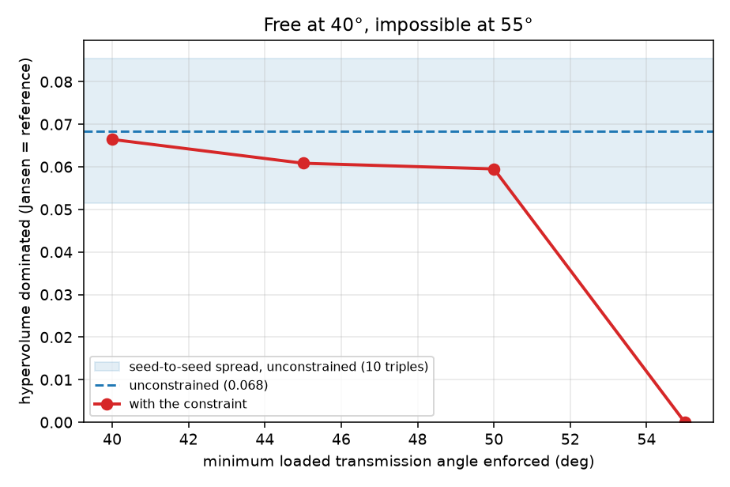

# Results

Everything on this page came out of code in this repo. Regenerate with:

```
python scripts/reproduce.py          # all four stages below, in order
```

or one stage at a time:

```
python scripts/gait_report.py        # gait metrics + stance-band sensitivity
python scripts/mechanics_report.py   # pin forces, wear, transmission angles
python scripts/run_optimization.py   # both Pareto fronts (~10 min, all cores)
python scripts/make_figures.py       # every figure below
python scripts/robustness.py         # the studies behind §7 (~50 min)
```

Where a number disagrees with Wang (2026), it is reported as a disagreement.
Nothing here has been tuned to match the paper.

---

## 1. The Jansen baseline

Holy numbers, branch `(-1,-1,1,-1,1)`, 1440 crank samples, stance band 1% of path
height. Foot path 67.91 mm wide × 22.46 mm tall.

| Metric | Ours | Paper (Table 4) | Difference |
|---|---|---|---|
| Step length | 43.41 mm | 43.3 mm | +0.3% |
| Ground clearance | 22.23 mm | 25.7 mm | −13.5% |
| Stance flatness | 0.0011 | 0.0281 | −96% |
| Velocity ripple | 0.0920 | 0.0956 | −3.8% |
| Duty factor | 31.2% | ≈20% | +56% |

Step length and velocity ripple reproduce. The other three do not, and
[`METRIC_DEFINITIONS.md`](METRIC_DEFINITIONS.md) shows why: the paper's five
numbers require five mutually incompatible definitions of "stance", spanning a
factor of 90, so no single definition reproduces its baseline row. The ground
clearance is not a definition problem at all — 25.7 mm is taller than our entire
foot path.

**Mechanical summary (new in this repo):**

| Quantity | Value |
|---|---|
| Peak pin force | 25.77 N at `G_bd`, against a 20 N ground reaction |
| Force amplification | 1.29 |
| Peak crank torque | 0.026 N·m |
| Wear per cycle | 4.67 × 10⁻⁵ mm³ |
| Min transmission angle, loaded | 42.7° |
| Min transmission angle, whole cycle | 8.6° |
| Branch margin | 0.27 |

---

## 2. The statics are verified, not just asserted

The inverse dynamics writes force and moment balance for all 7 moving bodies
(21 equations) and solves for the 10 pin reactions plus the crank torque
(21 unknowns). Nothing in that system knows about energy. So the check is
**virtual work**: at quasi-static equilibrium the motor's power must exactly
equal the power going into gravity and the ground reaction.

    residual = 4.1 × 10⁻⁵  (RMS mismatch / RMS torque, at 1440 samples)

and it falls with the square of the sample spacing, which is the signature of
finite-difference error rather than a modelling mistake. A sign error or a
misplaced moment arm anywhere in the 21×21 system would show up here and does
not.

The body decomposition is worth stating because the paper asserts "ten joints"
without deriving it. Three of the eleven bars close the triangle `G–J2–J3` and
three more close `J4–J5–F`; a triangle of rigid bars is one rigid body. That
leaves 7 moving bodies and exactly **10 revolute joints**, and Grübler agrees:
3(8−1) − 2(10) = 1 degree of freedom.

---

## 3. Where a Jansen leg actually wears out

Archard: worn volume = k × force × sliding distance, per joint, per crank
revolution.

| Joint | Mean force | Relative rotation | Sliding | Share of total wear |
|---|---|---|---|---|
| `O` (crank pin) | 4.03 N | 360° | 25.1 mm | 21.7% |
| `J1_j` | 2.65 N | 360° | 25.1 mm | 14.3% |
| `J1_k` | 2.43 N | 360° | 25.1 mm | 13.1% |
| `J5` | 3.41 N | 242° | 16.9 mm | 12.3% |

The three pins that turn a full revolution take 49% of the wear between them,
not because they are the most heavily loaded but because they slide the
furthest. Wear is force **times** distance, and on this linkage the distance
term is doing most of the sorting.

### The paper's mean-force shortcut costs 51%, not 3–4%

The paper computes wear from the cycle-*average* force rather than integrating
force against sliding, and argues the simplification costs 3–4%. We can measure
that instead of arguing it:

| | Wear per cycle |
|---|---|
| Mean-force form (the paper's) | 4.67 × 10⁻⁵ mm³ |
| Integrated form | 3.09 × 10⁻⁵ mm³ |
| **Overestimate** | **+51.3%** |

Converged across sampling (n = 360 → 5760 moves it by 0.1%). The cause is
physical: pin force and sliding rate are **anti-correlated** — the pins are
loaded hardest during stance, when they happen to be rotating slowest — so
averaging the force first and multiplying by total sliding counts the heavy load
against sliding that happens while unloaded.

The check that this is a real effect and not a bug in one of the two
calculations: at joint `O` they agree to 0.0%. That is the one joint where they
*must* agree analytically, because the crank turns at constant rate, so sliding
is uniform in crank angle and averaging first is exact there. Both calculations
are right; the shortcut is what is wrong.

This does not overturn the paper's central conclusion, which is stated as a
ratio: Jansen is Pareto-dominated under either wear definition. It does mean the
absolute wear numbers are high by about half.

It used to say, here, that the bias "partly cancels between designs, so the
ratio-based conclusions survive". That was reasoning rather than measurement, and
when it was finally measured it turned out to be wrong — re-running the campaign
against the integrated wear form moves the front by more than the search's own
run-to-run noise. The shortcut misplaces the *optimum*, not just the magnitude.
See §7.2.

---

## 4. The extension: transmission angle, and why "loaded" is the word that matters

*Transmission angle: when one bar pushes the next, the angle that decides how
much of the push becomes motion rather than a squeeze on the pin. 90° is
perfect, near 0° the joint binds and hammers itself. Machine-design practice
keeps it above about 40°.*

The paper never mentions it, which is a real gap in a paper about wear: a
shallow angle is itself a wear mechanism. But adding the obvious constraint
produces an obviously wrong answer.

| Measure | Jansen's linkage |
|---|---|
| Minimum transmission angle, whole cycle | **8.6°** — fails the 40° rule badly |
| Minimum transmission angle, during stance | **42.7°** — passes |


Both numbers are correct; they answer different questions. The 8.6° minimum
happens at crank angle 192°, in mid-swing, with the foot in the air and **0.6 N**
in the pin. The largest pin force of the cycle, 25.8 N, arrives at crank 335°
where the worst interface is at a healthy 48°. A shallow angle only costs you
something when there is force behind it.

So the constraint this repo enforces is the **minimum transmission angle during
stance**. That matters for honesty as much as for physics: the naive whole-cycle
constraint would have rejected Theo Jansen's own linkage for a defect that costs
nothing, and any Pareto front drawn under it would have been an artefact of a
badly posed constraint.

Read the other way, this is a compliment to the original design. Jansen's
linkage is not sloppy about transmission angles — it spends its shallow angles
exactly where they are free, and keeps them above the rule of thumb everywhere
they are paid for.

**Force amplification** is kept alongside as the measure that needs no
exclusions: the largest pin force in the cycle divided by the load carried.
Jansen sits at **1.29** — the pins carry about what the ground pushes. A design
near a singular pose runs to tens or hundreds, and that is what the constraint
layer is really there to catch.

---

## 5. The feasible region is a thin shell around Jansen

Not a headline result, but it changes how the optimization has to be run, so it
is reported rather than buried in a commit message.

Of 600 designs drawn uniformly from the paper's own ±30% box:

- 103 (17%) assemble through a full revolution at all
- **0** satisfy the paper's constraints (step length, clearance and duty factor
  each ≥ 0.85 × Jansen)

Step length and duty factor fail in essentially every one. Even jittering
Jansen's own lengths by 2% leaves only 4% of designs feasible.

The reason is a genuine coupling between the metric definition and the
constraint. Stance is a band near the lowest point of the foot path, so a design
that loses Jansen's unusually flat bottom stroke also loses most of the arc that
counts as stance — and its measured step length collapses with it. Under an
explicit definition, the paper's step-length constraint is therefore much
stricter than it looks: it is partly a flatness constraint in disguise.

Consequence: the search is seeded from the baseline (`optimize.seeded_population`)
rather than started uniformly. This biases *where the search begins*, not what
counts as good — the objectives and constraints are unchanged. The paper does not
say how it initialised.

---

## 6. Optimization

NSGA-II, population 100, 80 generations, three runs merged per campaign, fronts
re-scored at 1440 crank samples. Two campaigns: the paper's problem, then the
same problem with our loaded-transmission-angle constraint added. 20 minutes
total on one laptop core.


### The paper's headline claim reproduces — its magnitude does not

**Jansen's linkage is Pareto-dominated. Confirmed.** All 20 designs on the front
beat it on gait error *and* wear simultaneously. That is the paper's central
result and it survives an independent implementation.

The size of the win does not.

| Claim | Paper | Ours |
|---|---|---|
| Stance flatness | 28% better | 17% better |
| Velocity ripple | 58% better | 51% better |
| Wear | 56% less | **24% less** |
| Link-length changes | ≤29% | ≤8.5% |

The gait numbers are measured on the best-gait design, which is the comparison
the paper's own "representative redesign" invites.

The two gait numbers land close. The wear claim does not: the lowest wear ratio
anywhere on our front is 0.758, and the design that achieves it gives up gait to
get there. Nothing we found comes near a 56% reduction, and the designs that do
best on wear are not the ones that do best on gait — which is the whole point of
drawing a front rather than quoting one design.

Our optima also sit far closer to Jansen than the paper's do: no design anywhere
on our front moves a link by more than 8.5%, against their 29%. That is
consistent with §5 — the feasible set is a thin shell around Jansen, so a search
that respects the constraints cannot wander far. A search that reported 29%
changes was either exploring a region our constraints exclude, or measuring step
length in a way that tolerates a much less flat foot path.

Representative designs from the paper's (unconstrained) front, all re-scored at
1440 samples — the same count as every other table in this repo:

| Design | Gait error | Wear ratio | Step | Clearance | Duty | Min loaded angle |
|---|---|---|---|---|---|---|
| Jansen | 1.000 | 1.000 | 43.41 mm | 22.23 mm | 31.2% | 42.7° |
| Best gait | 0.658 | 0.992 | 44.43 mm | 18.91 mm | 33.3% | 41.9° |
| Balanced | 0.742 | 0.806 | 38.98 mm | 19.00 mm | 27.6% | 52.0° |
| Best wear | 0.811 | 0.758 | 37.68 mm | 19.15 mm | 26.7% | 46.7° |

"Balanced" is the design with the smallest sum of the two objectives. It is a
defensible pick and not the only one, which is why the whole front is saved to
`results/pareto.json` rather than just this row.

Read the table as the trade-off it is. The best-gait design buys its flat stance
by giving up essentially nothing on wear (0.992) — and it is the only one of the
three that keeps a *longer* step than Jansen. The other two buy their wear
reduction by shortening the stride to about 38 mm, right against the 0.85× floor
the paper's own constraints impose. Every design on the front loses ground
clearance, from 22.2 mm to roughly 19 mm: nothing in either objective rewards
lifting the foot higher, and only the 0.85× constraint stops it falling further.
That is a fair criticism of the paper's objective set, and it is ours too, since
we reproduced it deliberately.

### Our own constraint turns out to be nearly free — and that is a real result

The honest answer to "what does the manufacturability constraint cost?" is:
**almost nothing, because it was not binding in the first place.**

Across the 20 designs on the paper's unconstrained front, the minimum loaded
transmission angle runs from 41.9° to 52.0°, median 48.3°. **Not one of them
violates the 40° rule.** The two fronts in the figure lie essentially on top of
each other. The small differences between them (best gait error 0.658 against
0.676, best wear ratio 0.758 against 0.759) are run-to-run variation in a
stochastic search, not a price paid for the constraint — attributing them to the
constraint would be reading noise as signal.

That last sentence is the load-bearing one, so it is measured rather than
asserted. §7 runs the unconstrained campaign three times with different random
seeds and compares how far the front moves on its own against how far the
constraint moves it.

This is a negative result for the extension, and it is reported as one. But it is
not a wasted one, for two reasons.

First, **you could not have known it without checking.** "The optimizer's
preferred designs happen to be well-conditioned" is a finding about this problem,
not a general fact about linkage optimization. The constraint costs one extra
geometric evaluation per design, and the campaign that includes it is the evidence
that the paper's omission did not damage its conclusions here. A paper that
optimizes for wear while ignoring the geometry that drives wear got away with it
this time; that is worth knowing, and it is worth knowing *why*.

Second, the constraint is doing quiet work at the edges. The two designs on the
constrained front nearest the boundary sit at 42.0° and 42.4°, so the feasible
region is genuinely bounded by it — the search is just not choosing to go there,
because shallow-angle designs are not attractive on either objective anyway. Wear
and transmission angle turn out to be partly aligned objectives on this
mechanism: a shallow angle puts large forces through the pins, and large pin
forces are what the wear objective is already punishing. That is a satisfying
reason for the null result rather than a coincidence, and §7 tests it by
tightening the constraint until it does bite.

**What actually made the extension worth doing** is not the constraint but the
loaded/unloaded distinction in §4. That one changes an answer: naive whole-cycle
enforcement would have rejected Jansen's own linkage, and any front drawn under it
would have been an artefact.

---

## 7. Four things this write-up used to assert, now measured

Every claim in §6 above was once a sentence someone had reasoned their way to
rather than measured. Four of them were load-bearing enough to be worth the
compute, and `scripts/robustness.py` measures each one. Two came back confirming
the sentence. One came back changing it. One came back with a curve where there
had been a shrug.

**How two fronts are compared.** Comparing two sets of points needs one number,
and the honest one here is **hypervolume**: the area of the rectangle below-left
of Jansen that a front manages to cover. Both objectives are ratios to Jansen, so
Jansen sits at exactly (1, 1) and the unit square is the whole of what there is
to win — hypervolume is the fraction of it won. It rewards a front for being both
*good* (close to the origin) and *wide* (spread along the trade-off), and unlike
"best gait error" it cannot be moved by one lucky design at one corner.

### 7.1 The gap between the two fronts really is search noise

§6 says the difference between the constrained and unconstrained fronts is
run-to-run variation rather than a price paid for the constraint. That is the
load-bearing sentence of the whole negative result, and it had never been
measured. Measuring it is simple: run the *unconstrained* campaign three times
with different random seeds and see how far the front moves on its own.

| Campaign | Seeds | Front | Hypervolume | Best gait | Best wear |
|---|---|---|---|---|---|
| Unconstrained | 0, 1, 2 | 20 | 0.0684 | 0.658 | 0.758 |
| Unconstrained | 3, 4, 5 | 23 | 0.0660 | 0.666 | 0.775 |
| Unconstrained | 6, 7, 8 | 18 | 0.0673 | 0.688 | 0.744 |
| **Constrained, 40°** | 0, 1, 2 | 19 | **0.0664** | **0.676** | **0.759** |

| | Seed-to-seed spread | Constrained-vs-unconstrained gap |
|---|---|---|
| Hypervolume | 0.0024 | 0.0020 |
| Best gait error | 0.0297 | 0.0180 |

**The claim stands, and the cleanest way to say it is by inspection of the first
table.** The constrained campaign's hypervolume, 0.0664, falls *inside* the range
the three unconstrained campaigns span on their own (0.0660 to 0.0684). So does
its best gait error, 0.676, inside 0.658 to 0.688. Changing the random seed moves
the front further than adding the constraint does.

Two caveats, because the hypervolume margin is not large. 0.0020 against 0.0024 is
close, and three campaigns is a small sample from which to estimate a spread — this
establishes that the gap is *of the same order* as the noise, not that it is
provably zero. The best-gait comparison is more comfortable at 0.0180 against
0.0297. What would be indefensible is the version of this sentence that shipped
before: asserting "that is just noise" without ever measuring the noise.

### 7.2 The paper's mean-force shortcut changes the answer, not only the magnitude

This one came back against the write-up, so the write-up changed.

§3 established that computing wear from the cycle-mean force overestimates it by
51.3%. §3 then claimed the bias "partly cancels between designs, so the paper's
ratio-based conclusions survive". That was reasoning, not measurement. The test is
direct: re-run the same campaign with the second objective switched from the
paper's mean-force wear to the integrated form.

| Objective | Front | Hypervolume | Best gait | Best wear | Dominating Jansen |
|---|---|---|---|---|---|
| Mean-force wear (the paper's) | 20 | 0.0684 | 0.658 | 0.758 | 20 of 20 |
| Integrated wear | 23 | 0.0731 | 0.710 | 0.729 | 20 of 23 |

**The front moves, and it moves by more than the noise.** Say that on the axis
where the comparison is exact.

The wear axis is *not* exact between these two rows, and it is worth being precise
about why. 0.758 is a 24% reduction in *mean-force* wear; 0.729 is a 27% reduction
in *integrated* wear. Each campaign normalises against a Jansen measured its own
way, so each legitimately sits at (1, 1) — but the two numbers reduce different
quantities, and hypervolume, which mixes both axes, inherits that ambiguity.

**The gait axis has no such problem.** Stance flatness and velocity ripple are
computed identically in both campaigns; only the second objective changed. So the
best achievable gait error moving from **0.658 to 0.710** is a like-for-like
comparison, and that change of 0.052 is **1.8 times the 0.0297 seed-to-seed spread**
measured in §7.1. Changing which wear number you minimise moves the reachable gait
quality further than changing the random seed does. That is the finding, and it
rests on the clean axis alone.

What survives and what does not:

- **The paper's central claim survives.** Jansen is Pareto-dominated under either
  wear definition — 20 designs dominate it on the mean-force front, 20 on the
  integrated front. Nothing about the headline result depends on the shortcut.
- **"The bias partly cancels" does not survive.** It does not cancel enough to
  leave the optimum where it was. The shortcut systematically mis-weights which
  joints matter — it over-charges the pins that slide far while lightly loaded —
  so a search run against it prefers a measurably different set of designs.

That is the second substantive finding about the paper's shortcut, and it is the
more interesting one. The first says its absolute numbers are high by half. This
one says its *optimum* is in the wrong place, which is a claim about the method
rather than about the arithmetic.

### 7.3 The constraint is free at 40° and expensive by 45°

"The constraint turned out to be non-binding" is a weak sentence. Sweeping the
threshold turns it into a design rule.



| Minimum loaded angle enforced | Front | Hypervolume | Best gait | Best wear | Hypervolume lost |
|---|---|---|---|---|---|
| none | 20 | 0.0684 | 0.658 | 0.758 | — |
| 40° | 19 | 0.0664 | 0.676 | 0.759 | 2.9% |
| 45° | 18 | 0.0608 | 0.719 | 0.767 | 11.1% |
| 50° | 8 | 0.0595 | 0.727 | 0.779 | 13.0% |
| 55° | 9 | 0.0000 | 2.343 | 0.887 | 100% |

**The constraint is free at 40° and has a real price by 45°.** The 2.9% lost at
40° is smaller than the 3.5% the seed alone moves it (§7.1), so it is not a cost
at all. The 11.1% lost at 45° is more than three times that spread, so it is.

At **55° the constraint stops being a constraint and becomes a wall.** Nine designs
still satisfy it, but not one of them beats Jansen on both objectives — the best
gait error on that front is 2.343, more than twice Jansen's. Enforce 55° and the
answer to "can you beat Jansen?" becomes no.

The shape is worth more than any single row. Hypervolume falls monotonically as the
threshold tightens, which is what it must do — a tighter constraint can only shrink
the feasible set — but it falls *slowly* to 50° and then off a cliff. The knee sits
just past Jansen's own 42.7°, which is the satisfying part: **Jansen's linkage sits
almost exactly at the point where this constraint begins to cost something.** A few
degrees of margin more and it would be paying for the privilege.

As a design guideline, in one line: *enforce 40° for free; expect to give up
roughly a tenth of the achievable improvement to reach 45°; do not ask for 55° on
this mechanism.*

### 7.4 The conclusions survive the definition underneath them; the magnitudes do not

Everything in this repo rests on one definitional choice: stance is the arc of the
crank turn within **1% of path height** of the lowest point. §1 and
[`METRIC_DEFINITIONS.md`](METRIC_DEFINITIONS.md) show how the *baseline metrics*
move with that band. Neither shows whether the *optimization conclusions* do. So
the campaign is re-run at half and double the band.

| Stance band | Front | Dominating Jansen | Hypervolume | Best gait | Best wear |
|---|---|---|---|---|---|
| 0.5% | 7 | **7 of 7** | 0.0815 | 0.570 | 0.789 |
| **1.0%** (ours) | 20 | **20 of 20** | 0.0684 | 0.658 | 0.758 |
| 2.0% | 15 | **15 of 15** | 0.0618 | 0.725 | 0.741 |

**The paper's central claim is robust to the definition. Its magnitude is not.**

Jansen is Pareto-dominated at every band, and not marginally — every single design
on every front beats it on both objectives. A four-fold change in the definition of
stance does not touch the qualitative result, which is the reassuring half of this
study and the reason the reproduction in §6 can be trusted at all.

The numbers you would quote, however, move a great deal, and they move in opposite
directions:

| Band | "Gait error improved by" | "Wear reduced by" |
|---|---|---|
| 0.5% | 43.0% | 21.1% |
| 1.0% | 34.2% | 24.2% |
| 2.0% | 27.5% | 25.9% |

There is a mechanism behind the direction of each. A **narrower** band counts only
the very bottom of the stroke as stance, which is the flattest part of an already
flat curve — there is more headroom to flatten it further, so the gait improvement
looks larger. It also means the foot carries the 20 N ground reaction over less of
the turn, so there is less load-driven wear available to remove, and the wear
improvement looks smaller. Widening the band reverses both. Neither is an artefact;
each is the correct answer to a slightly different question about what "on the
ground" means.

**This is why the definitions are published.** A paper that reports "28% better
stance flatness" without writing down its stance rule has reported a number that
another implementation cannot check, and §1 is the demonstration that Wang's five
numbers cannot all come from one rule. The lesson generalises past this paper: on
this mechanism the stance threshold is not a detail of post-processing, it is a
modelling choice that moves the headline by a third.

**One thing the band does not explain.** The paper claims a 56% wear reduction; we
find 24% at our band. Across a four-fold change in the stance definition our figure
only moves between **21% and 26%** — it never approaches 56%, and it moves the wrong
way for a wider band to rescue it. So the wear-magnitude disagreement in §6 is
**not** a definitional artefact, and the hypothesis that it might have been is now
closed. That strengthens §6 rather than weakening it.

> **A note on this study, because it was wrong once.** The first run of it was
> meaningless and the mistake is instructive. `optimize.describe` passed the band
> to the gait metrics and to the transmission angles, but not to
> `dynamics.solve_statics` — which uses it to decide which crank samples carry the
> ground reaction, and therefore sets every pin force and all of the wear. So each
> design was scored with its gait measured under the new stance definition and its
> wear under the old one, and the resulting front was a chimera. Nothing published
> was affected, because every other campaign in this repo runs at the 1% default
> that the solver was already assuming; only this study moved the band, so only
> this study was wrong. It is fixed, the study was re-run from scratch, and
> `test_the_stance_band_reaches_the_statics_as_well_as_the_metrics` now fails if
> the band is ever dropped on that path again. The general lesson is the one worth
> keeping: a parameter that is threaded through one code path and silently
> defaulted on another produces plausible numbers, not a crash.

---

## 8. The ground-clearance gap, closed

This was the last open discrepancy in the repo. §1 reports the paper's 25.7 mm of
ground clearance against our 22.23 mm, and notes that it cannot be a stance-definition
problem because 25.7 mm does not fit inside our 22.46 mm foot path at all.
`METRIC_DEFINITIONS.md` then blamed "slightly different link lengths, or an unstated
normalization" and stopped. That is a hypothesis, not an answer, so
`scripts/clearance_fit.py` tests it.

The question, made precise: **is there a set of link lengths that produces both 43.3 mm
of step length and 25.7 mm of ground clearance, and how far from Jansen is it?**

### 8.1 The clearance alone is reachable inside the published precision

Before searching the whole box, ask the sharper question: what is the *smallest*
perturbation of the holy numbers that lands the clearance? A least-squares step
starting from Jansen itself answers it.

| Link | Jansen | Fitted | Change |
|---|---|---|---|
| `c` | 39.30 | 39.1934 | **−0.107 mm** |
| `k` | 61.90 | 62.0357 | **+0.136 mm** |
| `b, d, e, f, g, h, i, j` | | | all below 0.05 mm |

The holy numbers are published to 0.1 mm, so rounding alone admits ±0.05 mm on every
link. **Eight of the ten move by less than that** — they are not a different linkage,
they are the same linkage written down to one more decimal place. The other two move by
about a tenth of a millimetre.

That perturbation takes ground clearance from 22.23 mm to **25.71 mm**, reproducing the
paper's 25.7 mm to **0.06%**.

So the foot path near Jansen is extraordinarily sensitive in this direction: a tenth of
a millimetre in two links buys three and a half millimetres of lift, a 15% change in the
total height of the path. That alone is worth knowing before anyone machines one.

**But the lift is paid for out of the stride.** Walking from Jansen along that direction:

| | Path height | Ground clearance | Step length |
|---|---|---|---|
| Jansen | 22.46 | 22.23 | 43.41 |
| ¼ of the way | 23.25 | 23.02 | 42.76 |
| ½ | 24.10 | 23.86 | 42.18 |
| ¾ | 25.00 | 24.75 | 41.60 |
| **all the way** | 25.97 | **25.71** | **41.13** |

Clearance and step length are **anti-correlated** here. Landing the paper's clearance
costs 5.0% of its step length — and the step length is one of the two numbers we
currently *do* reproduce. You can have either of the paper's two geometric numbers from
a linkage indistinguishable from Jansen at published precision. You cannot have both.

### 8.2 Both together exist, but not near Jansen, and not with the paper's ripple

Widening the search to the paper's whole ±30% box, three restarts of a global search
followed by a least-squares polish:

| | Residual | Max link change | Step | Clearance | |
|---|---|---|---|---|---|
| restart 1 | 0.0415 | 24.6% | 44.95 (+3.8%) | 26.12 (+1.7%) | miss |
| restart 2 | 0.0573 | 25.5% | 45.78 (+5.7%) | 25.74 (+0.1%) | miss |
| **restart 3** | **0.0010** | **23.8%** | **43.34 (+0.1%)** | **25.70 (+0.0%)** | **hit** |

**So the targets are reachable** — there exists a linkage inside the paper's own bounds
that produces both numbers, essentially exactly. It sits **23.8%** from Jansen, which is
notably close to the "≤29%" link changes the paper reports for its *optimized* designs.

A penalty sweep trading fit against closeness (stage 2 in the script) failed to find an
exact fit any nearer than that. Read that as "we did not find one closer", not as a
proof that none exists: the penalised objective is rugged and the sweep is stochastic —
its own results are not monotone in the penalty weight, which is the honest signal that
it is sampling rather than solving.

**The cross-check is what settles it.** A linkage that matches step length and clearance
but wrecks a metric that currently agrees is not the design the paper measured either.
At that 23.8% design:

| Metric | This design | Paper | |
|---|---|---|---|
| Step length | 43.34 mm | 43.3 mm | matches |
| Ground clearance | 25.70 mm | 25.7 mm | matches |
| **Velocity ripple** | **0.0402** | **0.0956** | **58% off** |
| Duty factor | 30.4% | ≈20% | +52% |

Our Jansen reproduces the paper's velocity ripple to 3.8% (§1). This linkage misses it by
58%. Whatever mechanism the paper's Table 4 row describes, it is not this one.

### 8.3 What that means

**The "different link lengths" hypothesis is tested and refuted**, and the gap is closed
in the only way the evidence allows — by ruling things out rather than by explaining the
number away:

- It is **not** a stance-definition problem. 25.7 mm exceeds the entire path height, and
  §1 shows no single band reproduces the row anyway.
- It is **not** a small-geometry problem. A sub-rounding perturbation lands the clearance
  exactly, but costs 5% of the step length, so it cannot produce the row's other number.
- It is **not** a large-geometry problem either. A linkage 23.8% away does produce both,
  but its velocity ripple is 58% from the paper's — and the ripple is a number we
  otherwise reproduce.

All three roads fail, and they fail in different directions. The conclusion is the same
one §1 reaches from the stance side, now supported from the geometry side as well:
**Table 4's Jansen row is not the output of any single consistent model.** Its five
numbers cannot be reconciled by choosing a stance rule, and its two geometric numbers
cannot be reconciled by choosing link lengths.

That is a stronger and more defensible statement than "we cannot reproduce the ground
clearance", which is where this repo stood before. It is also the appropriate place to
stop: without the author's code, what remains is unknowable, and inventing a plausible
story for the number would be worth less than the ruled-out list above.


